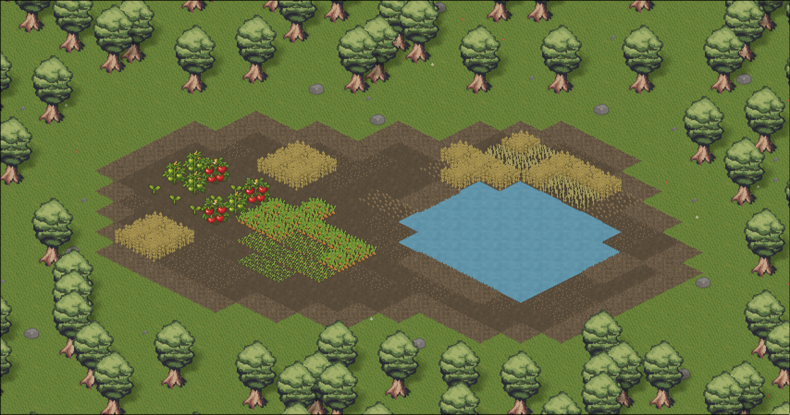
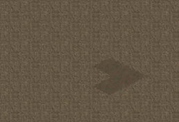
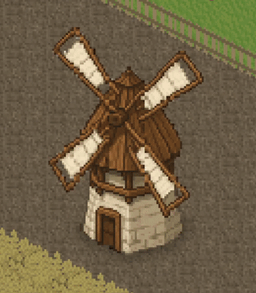
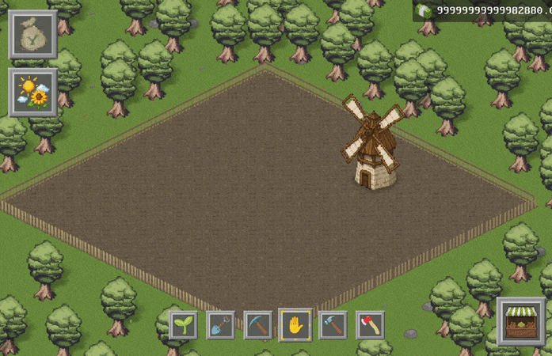
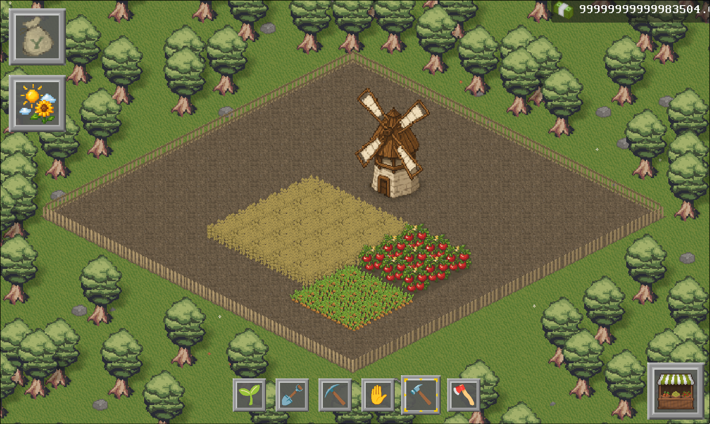
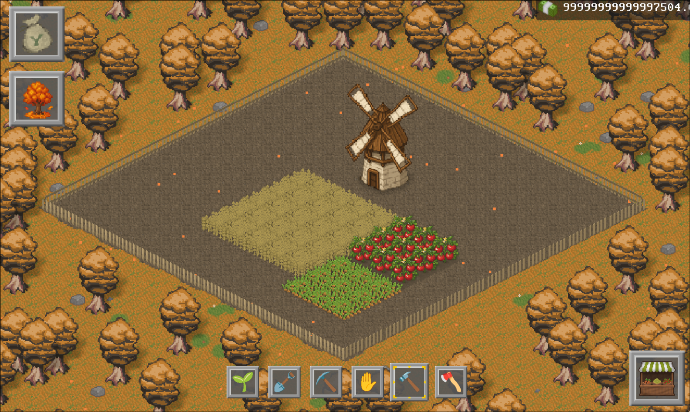
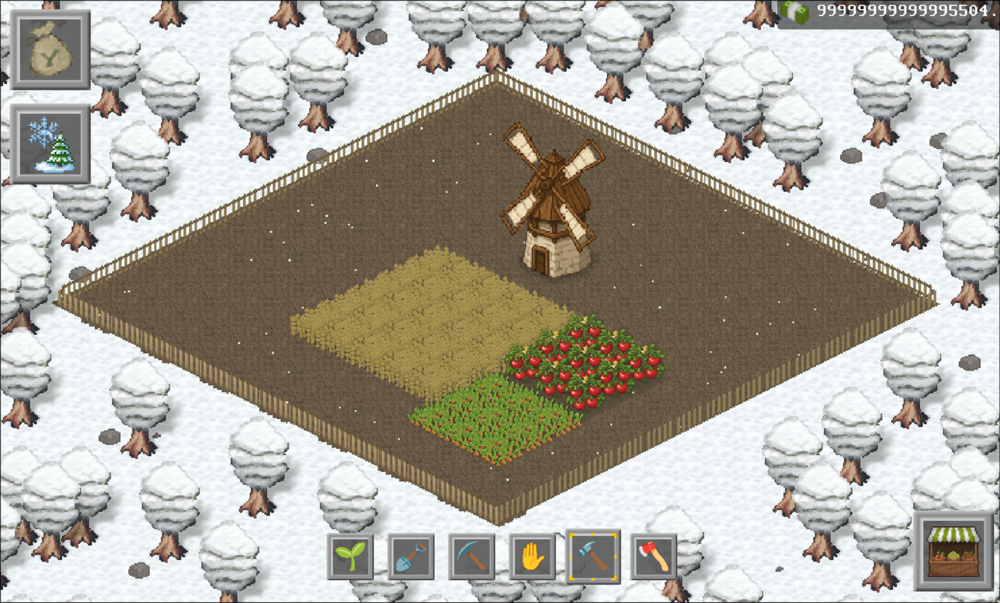
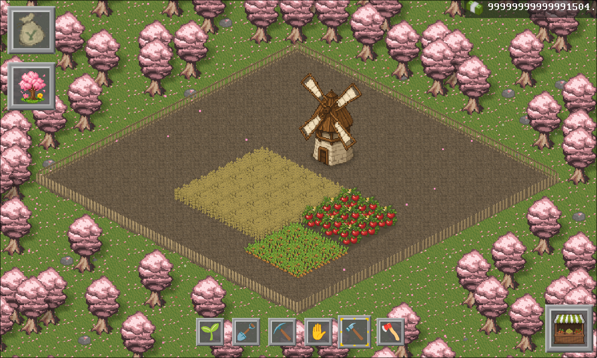
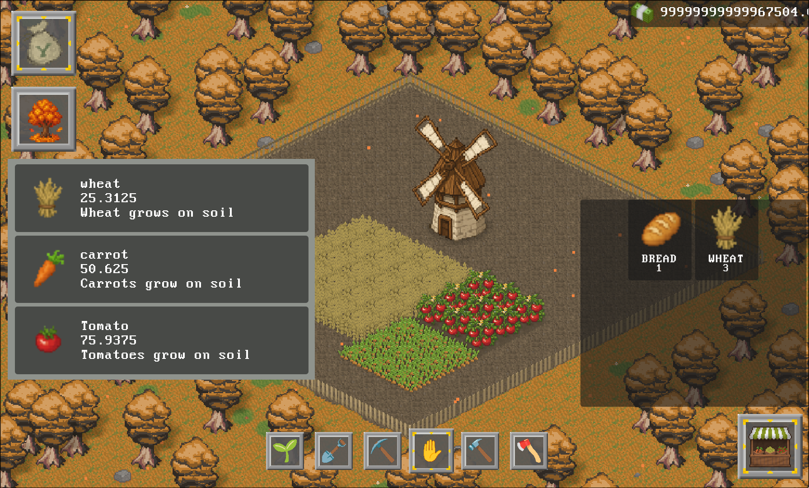

# 🌱 Stubborn Roots

### A singleplayer isometric pixel-art farming game built with Godot, designed for mobile.

Start with nothing but a humble starting capital of 100 coins. Plant crops, watch them grow in real time, harvest them, craft goods, and sell your way up - all while the seasons grow harsher and more expensive to endure.

---

## 🎮 Gameplay

Plant seeds on tilled soil, tend your farm as crops grow through multiple stages, then harvest and craft them into goods to sell for profit. Each season brings new visual atmosphere and economic pressure - and if you have enough money, you can skip ahead. But every skip costs more than the last.

The core loop:
**Plant → Grow → Harvest → Craft → Sell**


## ✨ Features

### 🗺️ Isometric Pixel Art World
Our game features a unique hand drawn isometric artstyle



### 🌾 Real-Time Crop Growth
Crops grow through multiple stages at varying speeds - no two fields look the same.



### 🍞 Crafting System
Combine harvested crops into crafted goods. Turn wheat into bread, sell for higher margins.



### 🍂 Dynamic Seasons
The world visually transforms each season - grass, trees, and particle effects all change. Autumn brings falling orange leaves, winter brings snow, spring brings pink blossoms. Additionally, each season increases the prices of sell and purchase prices, allowing you to afford better crops with time and making other crops obsolete, forcing you to build more in order to make it profitable.



<table>
  <tr>
    <td></td>
    <td></td>
  </tr>
  <tr>
    <td></td>
    <td></td>
  </tr>
</table>

### 📱 Mobile-First Design
Built from the ground up to be playable on mobile with a clean hotbar UI and touch-friendly controls.



---

## 🛠️ Built With

- [Godot 4](https://godotengine.org/)
- GDScript
- Custom hand drawn isometric tileset

---

## 📥 Installation 

```bash
git clone https://github.com/ncpast/stubborn-roots/
```

Open the project in Godot 4, hit play.

---

## 👥 Credits

|  |  |
|------|------|
| **Lead developer, artist and creative director** | ncpast |
| **Scripting, testing and quality assurance** | Rudn1k, dininiz |
| **Sound and visuals** | nipsii |
